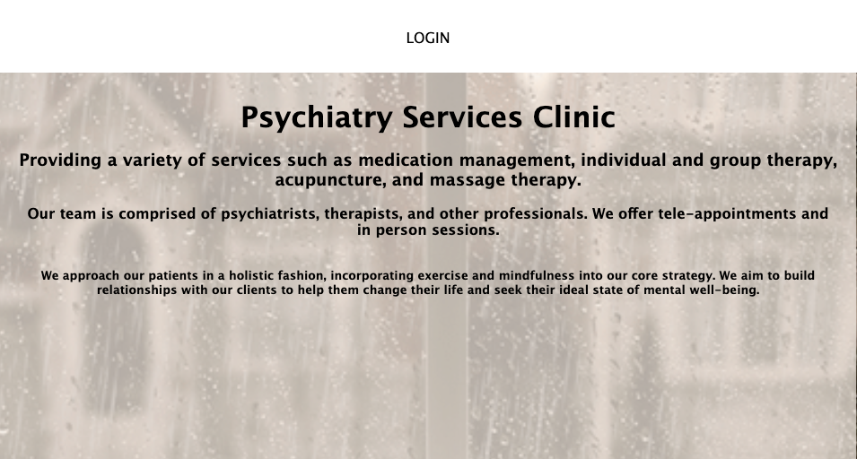
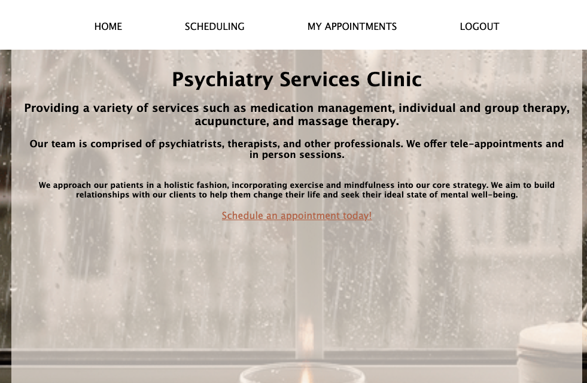
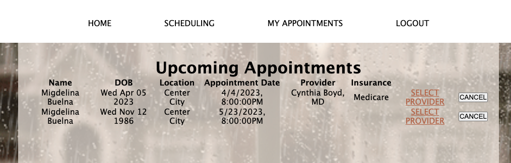
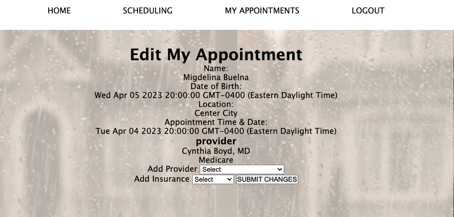

# Psychiatric Services Clinic

Scheduling system for a medical facility that allows patients to book appointments for mental health services. 
Patients are allowed to book as many appointments as they need in advance. 
Scheduled appointments by a single patient can only be viewed, scheduled, updated, and canceled by the patient themselves, for privacy purposes. 

<a href="https://dull-rose-rooster-kilt.cyclic.app/">Check out the app!</a>

### Home page - Logged out  

Users can only see the home page and login link if they are not logged in.
They failed login will always respond client with the home page. 

### Home page - Logged in

Once patient log into their google account, they will be able to navigate the site and use all the features. Our header holds the home, scheduling, my appointments, and log out links. 
The Schedule-an-appointment-today link in the middle of the home page takes us to the same place as the scheduling link in the header. 

### Scheduling 

Patients will be able to create an appointment using only their name, date of birth, locaion, and time. All fields are required. 

### Upcoming Uppointments

Patients can view all of their scheduled appointments and the details of them.
This page will also allow patients to either cancel appointments individually, or edit them by adding/changing insurance and/or provider. 

### Editing select appointment details

Once patients click on the select provider link they will be taken to the edit page where they can select/change a provider of choice, as well as an insurance plan.

Pantient can then log out, and they will be taken to the main logout home page. 

## Next Steps 
I will be working on making the details of the app more accurate, such as calendar limitaions for DOB and Appointment date, as well as block out dates where appointments are no longer available.

Additionally, I will be adding different services options and tie specific providers to those services. 